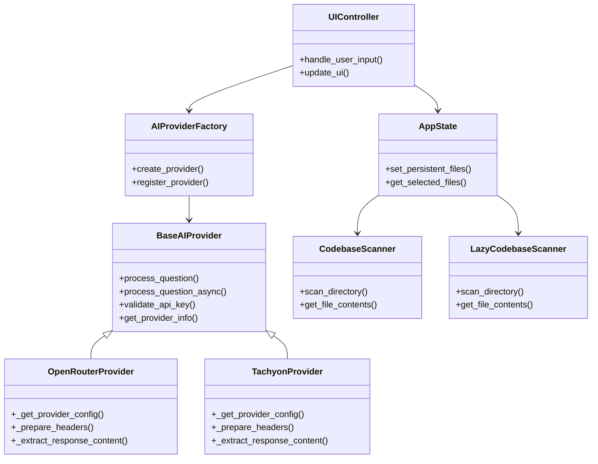
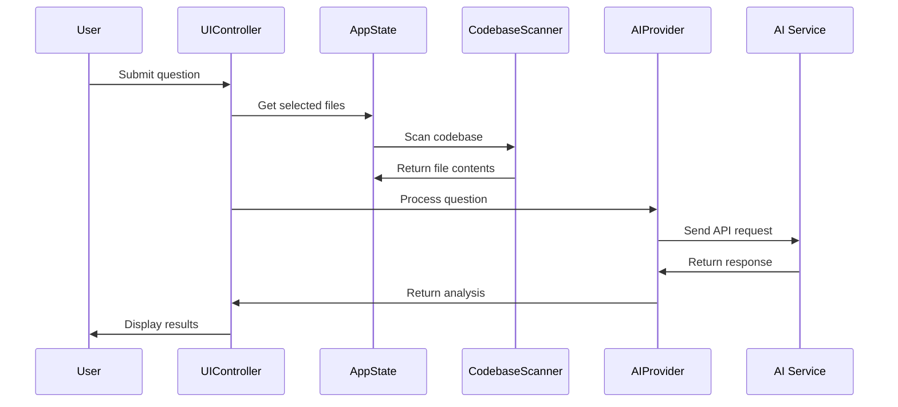

# API Documentation

## Overview

This document provides comprehensive API documentation for the Code Chat with AI application. The application is built using a modular architecture with clear separation of concerns, making it easy to extend and maintain.

## Core Architecture

### Architecture Overview



### AI Processing Flow



### Provider Pattern

The application uses a provider pattern for AI integration, allowing multiple AI services to be used through a consistent interface.

## BaseAIProvider

**Location**: [`base_ai.py:58`](base_ai.py:58)

Abstract base class defining the interface for all AI providers.

### Constructor

```python
BaseAIProvider(api_key: str = "")
```

**Parameters:**
- `api_key` (str): API key for the AI provider

### Abstract Methods

#### `_get_provider_config() -> AIProviderConfig`
Returns provider-specific configuration.

#### `_prepare_headers() -> Dict[str, str]`
Prepares HTTP headers for API requests.

#### `_prepare_request_data(messages: List[Dict], model: str) -> Dict[str, Any]`
Prepares request data for the AI API.

#### `_extract_response_content(response_data: Dict[str, Any]) -> str`
Extracts the AI response content from the API response.

#### `_extract_token_usage(response_data: Dict[str, Any]) -> Tuple[int, int, int]`
Extracts token usage information (prompt_tokens, completion_tokens, total_tokens).

#### `_handle_api_error(status_code: int, response_text: str) -> str`
Handles provider-specific API errors.

### Public Methods

#### `get_provider_name() -> str`
Returns the provider name.

#### `set_api_key(api_key: str)`
Sets the API key for the provider.

#### `validate_api_key() -> bool`
Validates that the API key is properly configured.

#### `get_provider_info() -> Dict[str, Any]`
Returns information about the provider.

#### `get_secure_debug_info() -> Dict[str, Any]`
Returns debug information with sensitive data masked.

#### `process_question(question: str, conversation_history: List[Dict[str, str]], codebase_content: str, model: str, update_callback: Optional[Callable[[str, str], None]] = None) -> str`

Processes a question using the AI API.

**Parameters:**
- `question` (str): User's question
- `conversation_history` (List[Dict[str, str]]): Previous conversation messages
- `codebase_content` (str): Combined codebase content
- `model` (str): AI model to use
- `update_callback` (Optional[Callable]): Callback for UI updates

**Returns:**
- AI response content (str)

**Raises:**
- Exception: If API call fails or API key is invalid

#### `process_question_async(question: str, conversation_history: List[Dict[str, str]], codebase_content: str, model: str, success_callback: Optional[Callable[[str], None]] = None, error_callback: Optional[Callable[[str], None]] = None, ui_update_callback: Optional[Callable[[str, str], None]] = None)`

Processes a question asynchronously with callbacks.

**Parameters:**
- `question` (str): User's question
- `conversation_history` (List[Dict[str, str]]): Previous conversation messages
- `codebase_content` (str): Combined codebase content
- `model` (str): AI model to use
- `success_callback` (Optional[Callable]): Called with AI response on success
- `error_callback` (Optional[Callable]): Called with error message on failure
- `ui_update_callback` (Optional[Callable]): Called for UI updates

## AIProviderConfig

**Location**: [`base_ai.py:46`](base_ai.py:46)

Configuration class for AI providers.

### Constructor

```python
AIProviderConfig(name: str, api_url: str, supports_tokens: bool = True)
```

**Parameters:**
- `name` (str): Provider name
- `api_url` (str): API endpoint URL
- `supports_tokens` (bool): Whether the provider supports token counting

### Attributes

- `name` (str): Provider name
- `api_url` (str): API endpoint URL
- `supports_tokens` (bool): Token support flag
- `headers` (Dict[str, str]): Default HTTP headers
- `auth_header` (str): Authentication header name
- `auth_format` (str): Authentication format string

## File Scanning System

### CodebaseScanner

**Location**: [`file_scanner.py:9`](file_scanner.py:9)

Standard codebase file scanner for smaller projects.

### LazyCodebaseScanner

**Location**: [`lazy_file_scanner.py:35`](lazy_file_scanner.py:35)

Lazy loading file scanner for large codebases with performance optimization.

## State Management

### AppState

**Location**: [`models.py:157`](models.py:157)

Application state management class.

### AppConfig

**Location**: [`models.py`](models.py)

Application configuration class.

## Security Utilities

### SecurityUtils

**Location**: [`security_utils.py:27`](security_utils.py:27)

Security utilities for API key management and data sanitization.

### Key Methods

#### `mask_api_key(api_key: str) -> str`
Masks sensitive parts of API keys for safe logging.

#### `validate_api_key_format(api_key: str, provider: str) -> bool`
Validates API key format for specific providers.

#### `sanitize_log_message(message: str) -> str`
Sanitizes log messages to remove sensitive information.

## Environment Management

### EnvManager

**Location**: [`env_manager.py:253`](env_manager.py:253)

Environment variable management with safe file operations.

### Key Methods

#### `update_single_var(key: str, value: str)`
Safely updates a single environment variable in the .env file.

## Pattern Matching

### PatternMatcher

**Location**: [`pattern_matcher.py:223`](pattern_matcher.py:223)

Advanced pattern matching for tool command detection.

### Key Methods

#### `is_tool_command(question: str, tool_vars: Dict[str, str], threshold: float = 0.5) -> bool`
Determines if a question contains tool commands that need codebase context.

## File Operations

### File Locking

**Location**: [`file_lock.py`](file_lock.py)

Safe JSON file operations with locking mechanisms.

### Key Functions

#### `safe_json_save(data: Any, filename: str, timeout: float = 10.0, backup: bool = True) -> bool`
Safely saves data to JSON file with file locking and backup.

#### `safe_json_load(filename: str, timeout: float = 10.0, default: Any = None) -> Any`
Safely loads data from JSON file with file locking.

## Logging System

### Logger

**Location**: [`logger.py:305`](logger.py:305)

Structured logging system with context support.

### Key Decorators

#### `@with_context`
Decorator that adds context information to log messages.

### Key Methods

#### `logger.set_context(component: str, operation: str)`
Sets logging context for structured logging.

## System Message Management

### SystemMessageManager

**Location**: [`system_message_manager.py`](system_message_manager.py)

Manages expert system messages for different analysis types.

### Key Methods

#### `get_system_message(codebase_content: str) -> str`
Retrieves the appropriate system message with codebase content.

#### `get_system_message_files_info() -> List[Dict]`
Returns information about available system message files.

## UI Components

### UIController

**Location**: [`ui_controller.py`](ui_controller.py)

Main UI controller managing interface components and user interactions.

### SimpleModernUI

**Location**: [`simple_modern_ui.py`](simple_modern_ui.py)

Modern UI components with theme support.

## CLI Interfaces

### CLIInterface

**Location**: [`cli_interface.py`](cli_interface.py)

Standard command-line interface implementation.

### Rich CLI

**Location**: [`cli_rich.py`](cli_rich.py)

Enhanced terminal interface with rich formatting and progress bars.

## Testing Framework

### Test Configuration

**Location**: [`tests/conftest.py:1`](tests/conftest.py:1)

Test configuration and fixtures for consistent testing.

### Key Fixtures

#### `mock_requests_post`
Mock fixture for AI API responses.

## Error Handling

The application implements comprehensive error handling:

- **Network Errors**: Automatic retry with exponential backoff
- **API Errors**: Provider-specific error handling
- **Validation Errors**: Input validation with user-friendly messages
- **Security Errors**: Safe error logging without sensitive data exposure

## Performance Optimizations

- **Lazy Loading**: For large codebases using LazyCodebaseScanner
- **Asynchronous Processing**: Non-blocking AI interactions
- **File Caching**: Optimized file content retrieval
- **Token Tracking**: Real-time usage monitoring

## Security Features

- **API Key Masking**: Sensitive data never logged in plain text
- **File Locking**: Safe concurrent file operations
- **Input Validation**: Comprehensive validation of user inputs
- **Error Sanitization**: Removal of sensitive information from error messages

## Extension Points

The modular architecture provides several extension points:

1. **AI Providers**: Implement BaseAIProvider for new AI services
2. **UI Components**: Extend UIController for new interface elements
3. **File Scanners**: Implement custom scanning strategies
4. **System Messages**: Add new expert modes via system message files
5. **Tool Integration**: Extend pattern matching for new tool commands

This documentation covers the core API components. For implementation details, refer to the source code and inline documentation.