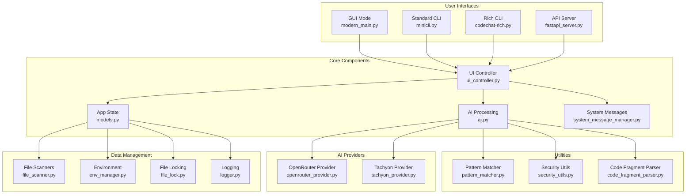
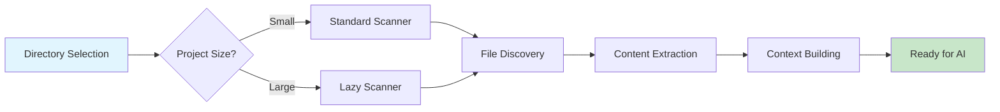
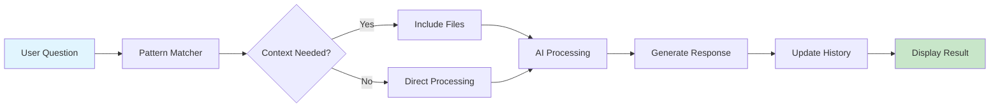

# Architecture Documentation

## Overview

Code Chat with AI is built using a modular, extensible architecture that supports multiple AI providers, interface modes, and advanced codebase analysis features. This document outlines the key architectural patterns and design decisions that make the application robust, maintainable, and extensible.

## High-Level Architecture



## Core Architectural Patterns

### 1. Provider Pattern

**Purpose**: Enable seamless integration of multiple AI services through a consistent interface.

**Implementation**: [`BaseAIProvider`](base_ai.py:23)

**Key Components**:
- **Abstract Base Class**: `BaseAIProvider` defines the contract for all AI providers
- **Provider Implementations**: Concrete classes like `OpenRouterProvider`, `TachyonProvider`
- **Factory Pattern**: `AIProviderFactory` creates provider instances dynamically
- **Configuration**: `AIProviderConfig` handles provider-specific settings

**Benefits**:
- Easy addition of new AI providers
- Consistent API across all providers
- Provider-specific optimizations possible
- Clean separation of concerns

**Usage**:
```python
# Create provider instance
provider = AIProviderFactory.create_provider("openrouter", api_key)

# Use consistent interface
response = provider.process_question(question, history, codebase, model)
```

### 2. Dual Scanner Architecture

**Purpose**: Optimize file scanning performance for different codebase sizes.

**Components**:
- **Standard Scanner**: [`CodebaseScanner`](file_scanner.py:9) for smaller projects
- **Lazy Scanner**: [`LazyCodebaseScanner`](lazy_file_scanner.py:35) for large codebases

**Decision Logic**:
```python
if estimated_files > 200 or total_size > 10MB or deep_directory_structure:
    use_lazy_scanner()
else:
    use_standard_scanner()
```

**Benefits**:
- Performance optimization for large codebases
- Memory-efficient processing
- Background scanning with progress updates
- Automatic selection based on project characteristics

### 3. Persistent Context Management

**Purpose**: Maintain conversation context across multiple interactions.

**Implementation**: [`AppState.set_persistent_files()`](models.py:157)

**Mechanism**:
1. First conversation turn saves selected files as "persistent"
2. Subsequent turns automatically include persistent files
3. Context persists until conversation is cleared
4. Tool commands automatically trigger codebase context inclusion

**Benefits**:
- Seamless multi-turn conversations
- No need to reselect files for follow-up questions
- Efficient context management
- Smart context detection for tool commands

### 4. File Locking System

**Purpose**: Ensure safe concurrent file operations.

**Implementation**: [`safe_json_save()`](file_lock.py) and [`safe_json_load()`](file_lock.py)

**Features**:
- File locking with timeout protection
- Automatic backup creation
- Corruption prevention
- Thread-safe operations

**Usage**:
```python
# Safe JSON operations
success = safe_json_save(data, "conversation.json", backup=True)
data = safe_json_load("conversation.json", default={})
```

### 5. Context-Aware Logging

**Purpose**: Provide structured, contextual logging for debugging and monitoring.

**Implementation**: [`@with_context`](logger.py:305) decorator and [`logger.set_context()`](logger.py:190)

**Features**:
- Component-based context tracking
- Operation-specific logging
- Performance monitoring
- Structured log output

**Usage**:
```python
@with_context
def process_question(self, question):
    logger.set_context(component="ai_processor", operation="question_processing")
    logger.info(f"Processing question: {question}")
```

### 6. Pattern Matching for Tool Commands

**Purpose**: Automatically detect when questions require codebase context.

**Implementation**: [`pattern_matcher.is_tool_command()`](pattern_matcher.py:223)

**Mechanism**:
- Analyzes questions against TOOL_* environment variables
- Uses confidence threshold for detection
- Integrates with persistent context system
- Supports custom tool definitions

**Benefits**:
- Automatic context inclusion for relevant questions
- Extensible tool command system
- Reduced user friction
- Smart context detection

## Security Architecture

### API Key Management

**Principles**:
- Never log raw API keys
- Use masking for debug output
- Secure storage in environment files
- Validation of key formats

**Implementation**:
```python
# Safe logging
masked_key = SecurityUtils.mask_api_key(api_key)
logger.info(f"Using API key: {masked_key}")

# Format validation
is_valid = SecurityUtils.validate_api_key_format(api_key, "openrouter")
```

### Error Handling

**Layers**:
1. **Network Layer**: Retry logic with exponential backoff
2. **API Layer**: Provider-specific error handling
3. **Application Layer**: User-friendly error messages
4. **Security Layer**: Error sanitization

**Features**:
- Automatic retry for transient failures
- Provider-specific error messages
- Sensitive data removal from errors
- User-friendly error presentation

## Interface Architecture

### Multiple Interface Modes

**Supported Interfaces**:
1. **GUI Mode**: Full graphical interface with modern UI
2. **Standard CLI**: Command-line interface for automation
3. **Rich CLI**: Enhanced terminal with progress bars and formatting
4. **API Server**: REST API for programmatic access

**Shared Components**:
- Common business logic in core modules
- Consistent configuration system
- Unified error handling
- Shared AI processing pipeline

### UI Controller Pattern

**Purpose**: Centralize UI state management and event handling.

**Implementation**: [`UIController`](ui_controller.py)

**Responsibilities**:
- Manage UI component interactions
- Handle user events and callbacks
- Coordinate between UI and business logic
- Maintain UI state consistency

## Data Flow Architecture

### Request Processing Flow


### File Scanning Flow



### Conversation Management Flow



## Performance Optimizations

### Lazy Loading Strategy

**When Applied**:
- Codebases with > 200 files
- Total size > 10MB
- Deep directory structures (> 8 levels)

**Benefits**:
- Reduced memory usage
- Faster initial response
- Background processing
- Progress feedback

### Asynchronous Processing

**Components**:
- Threaded AI requests
- Background file scanning
- Non-blocking UI updates
- Callback-based responses

**Benefits**:
- Responsive user interface
- Efficient resource utilization
- Better user experience
- Scalable processing

## Configuration Architecture

### Environment Variable Management

**Features**:
- Safe file operations with locking
- Single variable updates
- Validation and type checking
- Backup and recovery

**Implementation**: [`env_manager.update_single_var()`](env_manager.py:253)

### System Message Management

**Purpose**: Support multiple expert modes and analysis types.

**Features**:
- File-based system message definitions
- Dynamic loading and switching
- Custom message support
- Fallback to defaults

## Testing Architecture

### Test Organization

**Requirements**:
- Tests co-located with source files
- Consistent test fixtures
- Mock AI responses
- Standard naming conventions

**Structure**:
```
tests/
├── conftest.py          # Shared fixtures and configuration
├── test_*.py           # Individual test files
└── Test* classes       # Test class naming convention
```

### Mock Strategy

**Key Mocks**:
- AI API responses
- File system operations
- Network requests
- UI interactions

**Benefits**:
- Fast test execution
- Reliable test results
- Isolated testing
- CI/CD compatibility

## Extension Points

### Adding New AI Providers

1. Extend `BaseAIProvider`
2. Implement all abstract methods
3. Register with `AIProviderFactory`
4. Add provider-specific configuration

### Adding New Interface Modes

1. Create interface-specific entry point
2. Use shared business logic components
3. Implement consistent configuration
4. Follow established patterns

### Adding New System Messages

1. Create `systemmessage_*.txt` file
2. Follow established format
3. Add to system message manager
4. Update documentation

### Adding New Tools

1. Define TOOL_* environment variables
2. Update pattern matching rules
3. Implement tool-specific logic
4. Add documentation

## Deployment Architecture

### Packaging Strategy

**Components**:
- Python application with dependencies
- Configuration templates
- Documentation and examples
- Cross-platform compatibility

### Distribution Methods

**Options**:
- Source distribution
- Binary executables
- Docker containers
- Cloud deployment

## Monitoring and Observability

### Logging Strategy

**Levels**:
- ERROR: Critical failures
- WARNING: Potential issues
- INFO: Normal operations
- DEBUG: Detailed debugging

**Context**:
- Component identification
- Operation tracking
- Performance metrics
- User action logging

### Performance Monitoring

**Metrics**:
- API response times
- File scanning performance
- Memory usage
- Token consumption

**Implementation**:
- Built-in performance decorators
- Structured logging
- UI status updates
- Debug information

## Future Architecture Considerations

### Scalability

**Potential Enhancements**:
- Distributed processing
- Caching layer
- Database integration
- Microservices architecture

### AI Integration

**Future Providers**:
- Local AI models
- Custom fine-tuned models
- Multi-modal AI
- Real-time collaboration

### Interface Expansion

**Potential Interfaces**:
- Web-based interface
- Mobile applications
- IDE integrations
- API integrations

This architecture provides a solid foundation for current functionality while remaining flexible enough to accommodate future enhancements and new requirements.