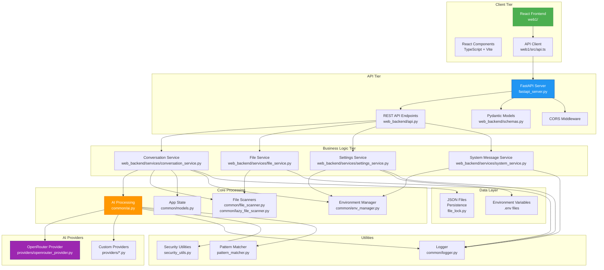
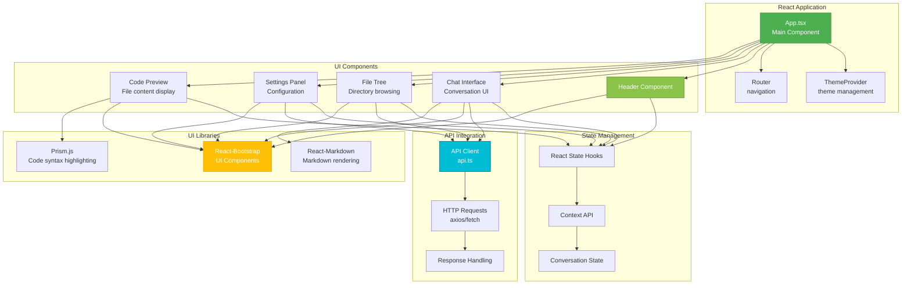
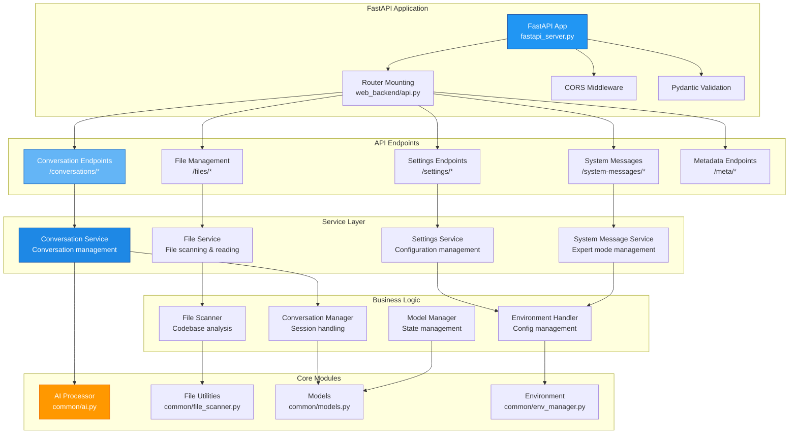
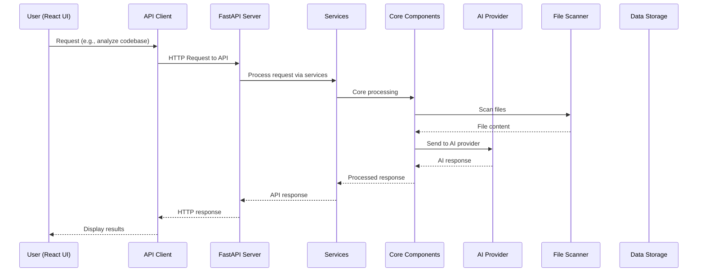

# WhisperCode Architecture Diagram

## High-Level Architecture

## React Frontend Architecture

## FastAPI Backend Architecture

## Data Flow Diagram

## Component Interaction Overview

The WhisperCode application follows a modern three-tier architecture:

1. **Presentation Layer** (React):
   - Provides intuitive user interface for code analysis
   - Handles user interactions and displays results
   - Manages client-side state and UI components

2. **Application Layer** (FastAPI):
   - Exposes REST API endpoints for all functionality
   - Handles request/response validation and routing
   - Orchestrates business logic through services
   - Manages security and authentication

3. **Data Layer** (Core & Providers):
   - Processes codebases and manages file operations
   - Integrates with multiple AI providers
   - Handles data persistence and configuration
   - Manages conversation history and context