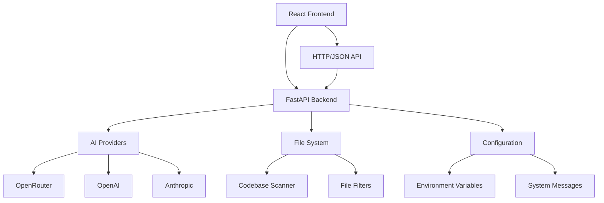

# Code Chat AI Architecture: FastAPI Backend & React Frontend

## Overview

The Code Chat AI application is a full-stack web application that provides AI-powered code analysis capabilities through a modern web interface. The architecture consists of a FastAPI backend serving REST APIs and a React frontend providing an interactive user experience.

## System Architecture



## Backend Architecture (FastAPI)

### Core Components

#### 1. Main FastAPI Server (`fastapi_server.py`)
The primary FastAPI application that serves as the entry point for the backend.

**Key Features:**
- RESTful API endpoints for code analysis
- CORS middleware for frontend communication
- Comprehensive error handling and logging
- Health check and metadata endpoints

**Main Endpoints:**
- `GET /health` - Server health status
- `GET /models` - Available AI models
- `GET /providers` - Available AI providers
- `GET /system-prompts` - System prompt templates
- `POST /analyze` - Code analysis with AI
- `GET /analyze-explicit` - Code analysis with explicit parameters

#### 2. Web Backend API (`web_backend/api.py`)
Extended API router providing comprehensive conversation and file management capabilities.

**Key Features:**
- Conversation lifecycle management
- File system operations
- Settings and theme management
- System message handling
- Directory scanning and content reading

**Main Endpoint Categories:**
- **Meta Endpoints:** `/meta/*` - Providers, models, UI defaults
- **Conversations:** `/conversations/*` - CRUD operations, question asking
- **Files:** `/files/*` - Directory scanning, content retrieval
- **Settings:** `/settings/*` - Theme, environment configuration
- **System Messages:** `/system-messages/*` - Message management

### Backend Services

#### Conversation Service (`web_backend/services/conversation_service.py`)
Manages conversation sessions and state persistence.

#### File Service (`web_backend/services/file_service.py`)
Handles file system operations including:
- Directory validation and scanning
- File content reading
- Directory tree building

#### Settings Service (`web_backend/services/settings_service.py`)
Manages application settings and theme preferences.

#### System Service (`web_backend/services/system_service.py`)
Handles system message templates and configurations.

### AI Integration

#### Provider Architecture
The backend supports multiple AI providers through a factory pattern:

```python
# Provider implementations in providers/
- OpenRouterProvider
- OpenAIProvider
- AnthropicProvider
- CustomProvider
```

#### AI Processing Flow
1. **Request Reception:** FastAPI receives analysis request
2. **File Scanning:** CodebaseScanner processes selected files
3. **Content Preparation:** File content is aggregated and filtered
4. **AI Processing:** Request sent to configured AI provider
5. **Response Formatting:** Results formatted and returned

## Frontend Architecture (React)

### Technology Stack
- **Framework:** React 18 with TypeScript
- **Build Tool:** Vite
- **Styling:** CSS Modules with theme support
- **State Management:** React hooks (useState, useEffect)
- **HTTP Client:** Fetch API with custom wrapper

### Application Structure

#### Main Components

##### App Component (`web1/src/App.tsx`)
The root component managing the overall application state.

**Key Responsibilities:**
- Tab management for multiple conversations
- Theme switching (light/dark mode)
- Modal management (settings, context, system messages)
- Global state coordination

##### Core UI Components
- **Header:** Model selection, system message management, action buttons
- **TabManager:** Conversation tab navigation and management
- **InputPanel:** Question input with tool command support
- **StatusBar:** Real-time status updates and badges
- **ChatView:** Message display and conversation history

##### Modal Components
- **ContextModal:** File and directory selection
- **SettingsModal:** API key and configuration management
- **SystemMessageModal:** System prompt selection and preview
- **AboutModal:** Application information

### State Management

#### Conversation State
Each conversation tab maintains its own state including:
- Message history
- Selected files and directory
- AI model and provider settings
- Processing status

#### Global State
Application-wide state managed at the App level:
- Theme preference
- System message options
- Available models and providers
- Tool commands

### API Integration

#### API Client (`web1/src/api.ts`)
Centralized HTTP client for backend communication.

**Key Functions:**
- `fetchUiDefaults()` - Load initial configuration
- `createConversation()` - Start new conversation
- `askQuestion()` - Send question to AI
- `setDirectory()` - Configure codebase context
- `updateSelectedFiles()` - Manage file selection

#### Configuration (`web1/src/config.ts`)
Environment-based configuration:
```typescript
export const appConfig = {
  backendBaseUrl: (import.meta.env.VITE_BACKEND_URL || 'http://localhost:8000').replace(/\/$/, ''),
};
```

## Data Flow

### Typical User Interaction Flow

1. **Application Startup**
   - Frontend loads UI defaults from `/meta/ui-defaults`
   - Creates initial conversation via `/conversations`
   - Sets up available models and providers

2. **Context Setup**
   - User selects directory via `/conversations/{id}/directory`
   - Files are scanned and displayed
   - User selects relevant files via `/conversations/{id}/files`

3. **Question Processing**
   - User submits question via `/conversations/{id}/question`
   - Backend processes files and sends to AI provider
   - Response is streamed back and displayed

4. **Conversation Management**
   - Multiple tabs supported via conversation CRUD operations
   - History can be exported/imported via dedicated endpoints

## Security Considerations

### API Key Management
- API keys stored in environment variables
- Keys masked in logs using `SecurityUtils.mask_api_key()`
- Keys transmitted securely via HTTPS in production

### CORS Configuration
- Configured for cross-origin requests from frontend
- Origins restricted in production environments

### Input Validation
- FastAPI Pydantic models for request validation
- File path validation to prevent directory traversal
- Content size limits for file processing

## Deployment Architecture

### Development Environment
- **Backend:** `python fastapi_server.py` (port 8000)
- **Frontend:** `npm run dev` in `web1/` (port 5173)
- **Communication:** HTTP localhost with CORS

### Production Environment
- **Backend:** FastAPI with ASGI server (e.g., Uvicorn)
- **Frontend:** Static files served by web server
- **Communication:** HTTPS with proper SSL certificates
- **Reverse Proxy:** Nginx/Apache for load balancing and SSL termination

## Performance Optimizations

### Backend Optimizations
- Lazy file scanning to reduce memory usage
- File filtering to process only relevant content
- Connection pooling for AI provider APIs
- Caching of provider metadata

### Frontend Optimizations
- React.memo for component optimization
- Lazy loading of modal components
- Efficient state updates with useCallback/useMemo
- Debounced API calls for file operations

## Monitoring and Logging

### Backend Logging
- Structured logging with timestamps
- Separate log files for different components
- Performance metrics tracking
- Error tracking with stack traces

### Frontend Monitoring
- API response time tracking
- Error boundary components
- User interaction analytics
- Performance monitoring

## Future Enhancements

### Potential Architecture Improvements
- **WebSocket Support:** Real-time streaming responses
- **Database Integration:** Persistent conversation storage
- **Microservices:** Separate services for AI processing
- **Caching Layer:** Redis for frequently accessed data
- **Containerization:** Docker deployment with orchestration

This architecture provides a scalable, maintainable foundation for AI-powered code analysis with a modern web interface.