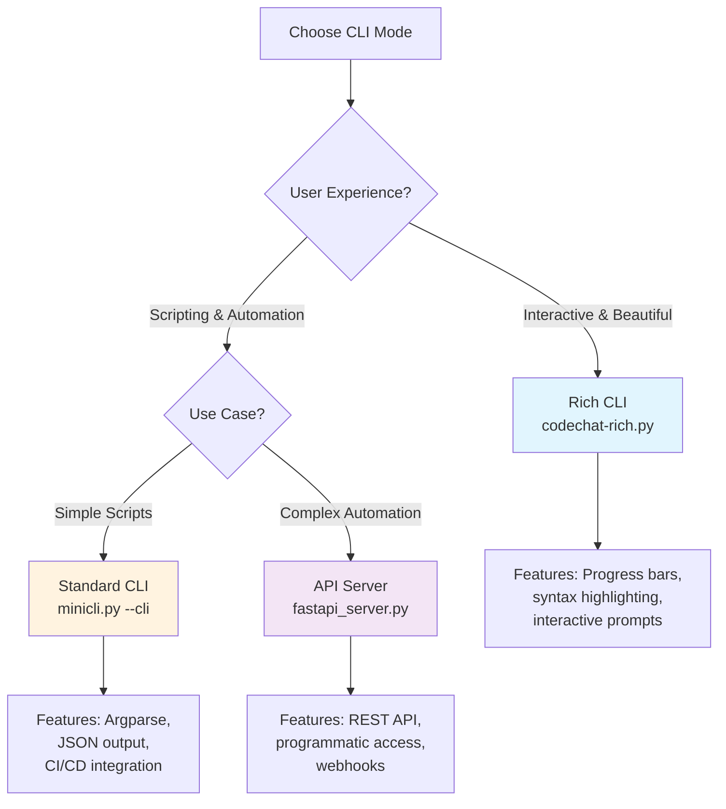

# 🖥️ CLI Usage Guide

Code Chat AI now offers **three** different ways to run the application - providing flexibility for every use case from interactive development to CI/CD automation.

## 🎯 Quick Mode Selection

- **🖥️ GUI Mode**: `python minicli.py` (Default - Full graphical interface)
- **🔧 Standard CLI**: `python minicli.py --cli` (Original command-line interface)
- **✨ Rich CLI**: `python codechat-rich.py` (Enhanced beautiful command-line interface)

## 📊 CLI Mode Selection Guide



---

## ✨ NEW: Rich CLI Mode (Enhanced)

The **Rich CLI** provides a beautiful, modern terminal experience with syntax highlighting, progress bars, interactive prompts, and rich formatting while maintaining full automation capabilities.

### 🚀 Quick Start - Rich CLI
```bash
# Interactive mode - prompts for everything step by step
python codechat-rich.py interactive

# Or call analyze without parameters for interactive prompts
python codechat-rich.py analyze

# Direct usage with parameters
python codechat-rich.py analyze ./src "What does this code do?"

# Or via main script
python minicli.py --rich-cli analyze ./src "What does this code do?"
```

### Rich CLI Commands

#### 🤖 analyze - Main analysis command
```bash
python codechat-rich.py analyze [FOLDER] [QUESTION] [OPTIONS]

# Basic usage
python codechat-rich.py analyze ./src "What does this code do?"

# Advanced usage with all Rich CLI features
python codechat-rich.py analyze ./src "Find security issues" \
  --model gpt-4 \
  --provider openrouter \
  --system-prompt security_expert \
  --include "*.py,*.js" \
  --exclude "test_*,*_test.py" \
  --output json \
  --save-to results.json \
  --lazy \
  --tree \
  --validate
```

#### Rich CLI Analysis Options:
- `--api-key, -k`: API key (overrides .env file)
- `--model, -m`: AI model to use
- `--provider, -p`: AI provider (openrouter, tachyon)
- `--system-prompt, -s`: System prompt name (e.g., 'security_expert')
- `--include, -i`: File patterns to include (comma-separated)
- `--exclude, -e`: File patterns to exclude (comma-separated)
- `--output, -o`: Output format (structured, json)
- `--save-to, -f`: Save output to file
- `--lazy`: Use lazy loading for large codebases
- `--tree/--no-tree`: Show/hide beautiful file tree (default: show)
- `--validate/--no-validate`: Validate/skip environment validation (default: validate)

#### 🔧 config - Configuration management
```bash
# Validate current configuration with detailed feedback
python codechat-rich.py config --validate

# Show current configuration in beautiful table
python codechat-rich.py config --show

# Interactive configuration setup with prompts
python codechat-rich.py config --interactive
```

#### 🤖 models - Model management
```bash
# List available models in beautiful table
python codechat-rich.py models

# Show models for specific provider
python codechat-rich.py models --provider openrouter

# Test a specific model with connection validation
python codechat-rich.py models --test gpt-4
```

#### 🎯 interactive - Fully interactive analysis mode
```bash
# Launch guided interactive analysis with step-by-step prompts
python codechat-rich.py interactive
```

#### 📋 version - Version information
```bash
python codechat-rich.py version
```

### Rich CLI Features
- 🎨 **Beautiful Output**: Syntax-highlighted code and JSON, rich tables and panels
- 📊 **Progress Bars**: Real-time progress indicators with time elapsed  
- 🌳 **File Tree View**: Visual representation of selected files with icons
- 🎯 **Interactive Prompts**: Step-by-step guided setup with smart suggestions
- 📈 **Live Updates**: Real-time processing status during AI requests
- 🔍 **Environment Validation**: Comprehensive configuration validation with suggestions
- 🎭 **Markdown Rendering**: Beautiful formatting of AI responses
- 🚀 **Smart Defaults**: Intelligent suggestions based on project structure
- 📝 **Question Templates**: Pre-built analysis templates for common tasks
- 🔧 **Interactive Configuration**: Guided setup for complex options

---

## 🔧 Standard CLI Mode

The original command-line interface using argparse, perfect for automation and scripting.

## 🚀 Quick Start

```bash
# Basic analysis
python minicli.py --cli --folder ./src --question "What does this code do?"

# With specific model and provider
python minicli.py --cli --folder ./src --question "Find security issues" --model gpt-4 --provider openrouter
```

## 📋 Command Line Arguments

### **Required Arguments (CLI Mode)**
- `--cli` - Enable CLI mode (required for headless operation)
- `--folder PATH` - Path to codebase directory to analyze
- `--question TEXT` - Question to ask about the codebase

### **AI Configuration**
- `--api-key KEY` - API key (overrides .env file)
- `--model MODEL` - AI model to use (e.g., `gpt-4`, `gpt-3.5-turbo`)
- `--provider {openrouter,tachyon}` - AI provider (overrides .env)
- `--system-prompt NAME` - System prompt to use (e.g., `security_expert`)

### **File Selection**
- `--include PATTERNS` - File patterns to include (comma-separated)
- `--exclude PATTERNS` - File patterns to exclude (comma-separated)

### **Output Control**
- `--output {structured,json}` - Output format (default: structured)
- `--save-to FILE` - Save output to file instead of stdout
- `--verbose, -v` - Show detailed progress information

## 📖 Detailed Usage

### **System Prompts**
Use existing system message files from the GUI version:

```bash
# Use security expert system prompt (systemmessage_security_expert.txt)
python minicli.py --cli --folder ./src --question "Review for vulnerabilities" --system-prompt security_expert

# Use code review system prompt (systemmessage_code_review.txt)  
python minicli.py --cli --folder ./src --question "Review this code" --system-prompt code_review
```

### **File Filtering**
Control which files are analyzed:

```bash
# Include only Python files
python minicli.py --cli --folder ./src --question "Analyze code" --include "*.py"

# Include Python and JavaScript, exclude tests
python minicli.py --cli --folder ./src --question "Review code" --include "*.py,*.js" --exclude "test_*,*_test.py"

# Exclude specific directories (uses existing IGNORE_FOLDERS from .env by default)
python minicli.py --cli --folder ./src --question "Analyze" --exclude "__pycache__,node_modules,dist"
```

### **Output Formats**

#### **Structured Output (Default)**
```bash
python minicli.py --cli --folder ./src --question "Explain this code"
```
```
Model: gpt-4
Provider: openrouter
Time: 2.34s
Timestamp: 2023-12-01 14:30:22

Response:
This codebase implements a modern Python application with...
```

#### **JSON Output**
```bash
python minicli.py --cli --folder ./src --question "Explain this code" --output json
```
```json
{
  "response": "This codebase implements a modern Python application with...",
  "model": "gpt-4",
  "provider": "openrouter", 
  "processing_time": 2.34,
  "timestamp": "2023-12-01 14:30:22"
}
```

### **Configuration Priority**
CLI arguments override .env file settings:

1. CLI arguments (highest priority)
2. .env file settings
3. Application defaults (lowest priority)

```bash
# This overrides API_KEY and DEFAULT_MODEL from .env
python minicli.py --cli --folder ./src --question "Analyze" --api-key sk-new123 --model gpt-4
```

## 🔧 Configuration

### **.env File Integration**
The CLI uses the same `.env` file as the GUI:

```env
# API Configuration
API_KEY=sk-your-key-here
OPENROUTER_API_KEY=sk-or-your-key-here
PROVIDER=openrouter
DEFAULT_MODEL=openai/gpt-4

# Available Models
MODELS=openai/gpt-3.5-turbo,openai/gpt-4,anthropic/claude-3-sonnet

# File Scanning
IGNORE_FOLDERS=venv,.venv,node_modules,__pycache__,dist,build
```

### **System Message Files**
Create custom system prompts by adding files like:
- `systemmessage_security_expert.txt`
- `systemmessage_code_review.txt`
- `systemmessage_performance.txt`

## 📝 Examples

### **Basic Code Analysis**
```bash
python minicli.py --cli --folder ./my-project --question "What is the main purpose of this codebase?"
```

### **Security Review**
```bash
python minicli.py --cli \
  --folder ./src \
  --question "Identify potential security vulnerabilities" \
  --system-prompt security_expert \
  --model gpt-4 \
  --include "*.py,*.js" \
  --exclude "test_*"
```

### **Performance Analysis with JSON Output**
```bash
python minicli.py --cli \
  --folder ./backend \
  --question "Identify performance bottlenecks and suggest optimizations" \
  --system-prompt performance \
  --output json \
  --save-to performance_report.json \
  --verbose
```

### **Documentation Generation**
```bash
python minicli.py --cli \
  --folder ./api \
  --question "Generate API documentation for these endpoints" \
  --include "*.py" \
  --exclude "__init__.py,test_*" \
  --save-to api_docs.md
```

### **Code Quality Assessment**
```bash
python minicli.py --cli \
  --folder ./src \
  --question "Assess code quality and suggest improvements" \
  --system-prompt code_review \
  --provider openrouter \
  --model anthropic/claude-3-sonnet
```

## 🔄 Automation & Scripting

### **CI/CD Integration**
```bash
#!/bin/bash
# security_scan.sh - Run security analysis in CI pipeline

python minicli.py --cli \
  --folder ./src \
  --question "Identify security issues that need immediate attention" \
  --system-prompt security_expert \
  --output json \
  --save-to security_report.json

# Check if critical issues were found
if grep -q "CRITICAL\|HIGH" security_report.json; then
  echo "Security issues found - failing build"
  exit 1
fi
```

### **Batch Processing**
```bash
#!/bin/bash
# analyze_modules.sh - Analyze multiple directories

MODULES=("auth" "api" "database" "utils")

for module in "${MODULES[@]}"; do
  echo "Analyzing $module module..."
  python minicli.py --cli \
    --folder "./src/$module" \
    --question "Summarize the purpose and key functions of this module" \
    --save-to "reports/${module}_analysis.md" \
    --verbose
done
```

## 🐛 Error Handling

### **Common Error Scenarios**

1. **Missing API Key**
   ```
   ERROR: No API key configured. Set API_KEY in .env file or use --api-key argument.
   ```

2. **Invalid Directory**
   ```
   ERROR: Directory does not exist: ./nonexistent
   ```

3. **No Files Found**
   ```
   ERROR: No files found after applying filters.
   ```

4. **System Prompt Not Found**
   ```
   ERROR: System prompt file 'systemmessage_custom.txt' not found.
   ```

### **Exit Codes**
- `0` - Success
- `1` - Error (configuration, file system, API, etc.)

## 💡 Tips & Best Practices

### **Performance**
- Use `--include` filters to analyze only relevant files
- Exclude test files and build artifacts with `--exclude`
- Use `--verbose` to monitor progress on large codebases

### **Output Management**
- Use `--save-to` for automation scripts
- Use JSON output (`--output json`) for parsing results programmatically
- Redirect stderr for cleaner automation: `2>/dev/null`

### **Security**
- Never hardcode API keys in scripts - use `.env` files or environment variables
- Use different system prompts for different analysis types
- Consider rate limits when processing multiple projects

### **System Prompts**
- Create specialized prompts for different use cases:
  - `security_expert` - Security vulnerability analysis
  - `performance` - Performance optimization suggestions  
  - `documentation` - Documentation generation
  - `testing` - Test coverage and quality analysis

## 🔗 Integration Examples

### **Git Hooks**
```bash
# .git/hooks/pre-commit
#!/bin/bash
echo "Running security analysis..."
python minicli.py --cli --folder ./src --question "Check for security issues" --system-prompt security_expert --output json > /tmp/security.json

if grep -q "vulnerability\|security\|exploit" /tmp/security.json; then
  echo "⚠️  Security issues detected - please review before committing"
  exit 1
fi
```

### **GitHub Actions**
```yaml
name: Code Analysis
on: [push, pull_request]

jobs:
  analyze:
    runs-on: ubuntu-latest
    steps:
      - uses: actions/checkout@v2
      - name: Setup Python
        uses: actions/setup-python@v2
        with:
          python-version: '3.11'
      - name: Install dependencies
        run: pip install -r requirements.txt
      - name: Run code analysis
        env:
          API_KEY: ${{ secrets.OPENROUTER_API_KEY }}
        run: |
          python minicli.py --cli \
            --folder ./src \
            --question "Identify potential issues in this code" \
            --output json \
            --save-to analysis.json
      - name: Upload results
        uses: actions/upload-artifact@v2
        with:
          name: code-analysis
          path: analysis.json
```

The CLI interface provides powerful automation capabilities while maintaining the same high-quality analysis as the GUI version. Perfect for integrating AI-powered code analysis into your development workflow! 🚀