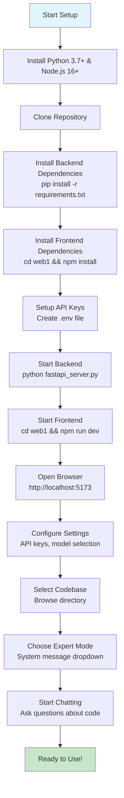
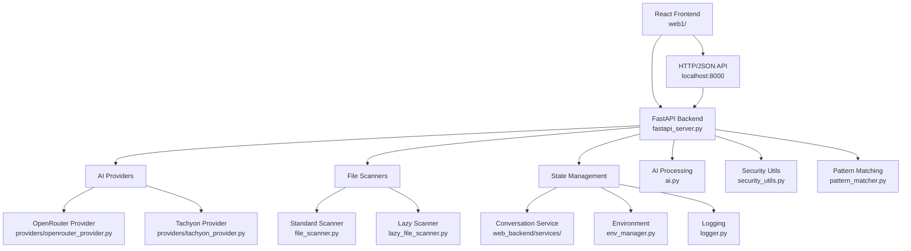

# Code Chat with AI

> A modern full-stack web application for intelligent code analysis and AI-powered development assistance

[](https://python.org)
[](https://reactjs.org)
[](https://fastapi.tiangolo.com)
[](LICENSE)
[](https://github.com)

**Code Chat with AI** is a powerful full-stack web application that brings AI assistance directly to your development workflow. Select any codebase, choose from specialized AI experts, and get intelligent insights, code reviews, and architectural guidance through an intuitive web interface.


---

## 🚀 Quick Start

### Prerequisites
- **Python 3.7 or higher** ([Download here](https://python.org/downloads/))
- **Node.js 16 or higher** ([Download here](https://nodejs.org/))
- **Git** (optional, for cloning)
- **API Key** from [OpenAI](https://openai.com/api/) or [OpenRouter](https://openrouter.ai/)

### Installation

1. **Clone or Download the Repository**
   ```bash
   git clone https://github.com/your-username/code-chat-ai.git
   cd code-chat-ai
   ```
   
   *Or download and extract the ZIP file*

2. **Install Backend Dependencies**
    ```bash
    pip install -r requirements.txt
    ```

    *For virtual environment (recommended):*
    ```bash
    python -m venv venv
    # Windows:
    venv\Scripts\activate
    # macOS/Linux:
    source venv/bin/activate

    pip install -r requirements.txt
    ```

3. **Install Frontend Dependencies**
    ```bash
    cd web1
    npm install
    cd ..
    ```

3. **Set Up API Keys**
   
   **Option A: Environment File (Recommended)**
   
   Create a `.env` file in the project root:
   ```env
   # Required: At least one API key
   OPENAI_API_KEY=sk-your-openai-key-here
   OPENROUTER_API_KEY=sk-your-openrouter-key-here
   
   # Optional: Customize default settings
   DEFAULT_MODEL=openai/gpt-4
   UI_THEME=light
   MAX_TOKENS=2000
   TEMPERATURE=0.7
   ```
   
   **Option B: Through the Application**
   
   Run the app and click **Settings** → **Environment Variables** to configure your API keys.

4. **Launch the Application**

     **Web Application Mode (Recommended):**
     ```bash
     # Start the FastAPI backend
     python fastapi_server.py

     # In another terminal, start the React frontend
     cd web1 && npm run dev
     ```

     **Desktop GUI Mode:**
     ```bash
     python modern_main.py
     ```

     **Alternative GUI Launchers:**
     ```bash
     # For window visibility issues:
     python start_ui.py

     # Windows batch file:
     run_app.bat
     ```

     **CLI Modes:**
     ```bash
     # Standard CLI mode:
     python minicli.py --cli --folder ./src --question "What does this code do?"

     # Rich CLI mode (enhanced terminal interface):
     python codechat-rich.py analyze ./src "What does this code do?"
     ```

---

## 🚀 Quick Start Workflow



---

## 🏗️ Architecture Overview



---

## ✨ Features

### 🤖 **AI-Powered Code Analysis**
- Chat with specialized AI experts about your codebase
- Multiple expert modes: Security Auditor, Performance Engineer, Code Reviewer, etc.
- Context-aware responses based on your selected files

### 🎨 **Modern User Interface**
- **Dark/Light Theme Support** - Toggle with one click
- **Tabbed Conversations** - Manage multiple chat sessions
- **Responsive Design** - Clean, professional interface
- **Rich Markdown Rendering** - AI responses formatted with GitHub-style Markdown (headings, tables, code blocks)
- **Code Fragment Extraction** - Easily copy code suggestions with toast notifications

### 📁 **Smart File Management**
- **Intelligent File Scanning** - Automatically detects relevant code files
- **Persistent Context** - Selected files remembered across conversation turns
- **Project Detection** - Recognizes common project structures

### 🔧 **Multiple AI Providers**
- **OpenRouter Integration** - Access to 100+ AI models from multiple providers
- **Tachyon Provider** - Custom AI provider support
- **Provider Factory Pattern** - Extensible architecture for adding new providers
- **Flexible Configuration** - Easy provider switching and model selection
- **Token Tracking** - Real-time token usage and cost monitoring

### 💻 **Multiple Interface Modes**
- **GUI Mode** - Full graphical interface with modern UI
- **Standard CLI** - Command-line interface for automation and scripting
- **Rich CLI** - Enhanced terminal interface with syntax highlighting and progress bars
- **Interactive Mode** - Step-by-step guided analysis with smart prompts
- **API Server** - REST API for programmatic access and integrations
- **Batch Processing** - Automated analysis of multiple codebases

### � **Conversation Management**
- **Save/Load History** - Never lose important conversations  
- **Export Options** - Save conversations as JSON files
- **New Conversation** - Clean slate for different topics

---

## 📖 Usage Guide

### Getting Started

1. **Launch the Application**
    ```bash
    # GUI Mode (recommended for first-time users):
    python modern_main.py

    # Or use the Rich CLI for enhanced terminal experience:
    python codechat-rich.py interactive
    ```

2. **Configure Your API Key** (First Time Only)
   - Click the **Settings** button
   - Add your OpenAI or OpenRouter API key
   - Select your preferred AI model

3. **Select Your Codebase**
   - Click **Browse** to select a directory containing your code
   - The app will automatically scan for relevant files
   - Check/uncheck files to include in the analysis

4. **Choose an AI Expert**
   - Use the **System Message** dropdown to select an expert:
     - **Default** - General coding assistance
     - **Security** - Security audits and vulnerability analysis
     - **Performance** - Performance optimization suggestions
     - **Code Review** - Comprehensive code quality analysis
     - **Architecture** - System design and architecture advice
     - And more specialized experts...

5. **Start Chatting**
   - Type your questions in the chat area
   - Use **Execute System Prompt** for immediate expert analysis
   - Get AI-powered insights, suggestions, and code improvements

### Advanced Features

#### **Code Fragment Extraction**
When AI responses contain code blocks marked with triple backticks (```), a **📋 Code Fragments** button appears:
- Click to view all code suggestions
- Select and copy specific code blocks to clipboard
- Perfect for implementing AI suggestions

#### **Theme Switching**
Toggle between light and dark themes:
- Click the **🌙 Dark** / **☀️ Light** button in the toolbar
- Preference is automatically saved
- Restart recommended for full effect

#### **Persistent File Context**
Files selected in your first conversation are automatically remembered:
- No need to reselect files for follow-up questions
- Context persists until you start a new conversation
- Clear conversation to reset file selection

---

## ⚙️ Configuration

### Environment Variables

Create a `.env` file in the project root to customize the application:

```env
# API Configuration (Required)
OPENAI_API_KEY=sk-your-openai-key-here
OPENROUTER_API_KEY=sk-your-openrouter-key-here

# Model Settings
DEFAULT_MODEL=openai/gpt-4                    # Default AI model
MODELS=openai/gpt-3.5-turbo,openai/gpt-4     # Available models (comma-separated)

# UI Preferences
UI_THEME=light                                # Theme: 'light' or 'dark'
CURRENT_SYSTEM_PROMPT=systemmessage_default.txt  # Default expert mode

# AI Parameters
MAX_TOKENS=2000                               # Maximum response length
TEMPERATURE=0.7                               # AI creativity (0.0-1.0)

# File Scanning
IGNORE_FOLDERS=node_modules,venv,.git         # Folders to ignore (comma-separated)

# Tool Commands (Advanced)
TOOL_LINT=pylint                              # Custom linting command
TOOL_TEST=pytest                              # Custom test command
```

### System Messages (Expert Modes)

The application includes specialized system messages for different analysis types:

| File | Expert Mode | Use Case |
|------|-------------|----------|
| `systemmessage_default.txt` | General Assistant | Balanced code analysis |
| `systemmessage_security.txt` | Security Auditor | Vulnerability assessment |
| `systemmessage_performance.txt` | Performance Engineer | Optimization suggestions |
| `systemmessage_codereview.txt` | Code Reviewer | Quality and best practices |
| `systemmessage_architecture.txt` | System Architect | Design and structure |
| `systemmessage_debugging.txt` | Debug Specialist | Bug finding and fixes |
| `systemmessage_testing.txt` | Test Engineer | Test coverage and strategy |
| `systemmessage_optimization.txt` | Optimization Expert | Code optimization and refactoring |
| `systemmessage_refactoring.txt` | Refactoring Specialist | Code restructuring and cleanup |
| `systemmessage_documentation.txt` | Documentation Expert | Documentation generation |
| `systemmessage_beginner.txt` | Beginner Assistant | Simplified explanations |

### Advanced Settings

Access advanced configuration through **Settings** → **Environment Variables**:

- **API Keys** - Configure OpenAI and OpenRouter access
- **Model Selection** - Choose default AI models
- **UI Preferences** - Theme and interface settings  
- **Performance Tuning** - Token limits and temperature
- **Tool Integration** - Custom linting and testing commands

---

## 🗂️ Project Structure

```
code-chat-ai/
├── 📁 Web Frontend (React)
│   ├── web1/                  # React application
│   │   ├── src/               # React source code
│   │   │   ├── components/    # React components
│   │   │   ├── api.ts         # API client for backend communication
│   │   │   ├── App.tsx        # Main React application
│   │   │   └── types.ts       # TypeScript type definitions
│   │   ├── package.json       # Frontend dependencies
│   │   └── vite.config.ts     # Vite build configuration
│   └──
├── 📁 Backend (FastAPI)
│   ├── fastapi_server.py      # Main FastAPI server
│   ├── web_backend/            # FastAPI application modules
│   │   ├── api.py              # REST API endpoints
│   │   ├── schemas.py          # Pydantic models
│   │   └── services/           # Business logic services
│   └──
├── 📁 Core Application
│   ├── minicli.py              # Main application orchestration
│   ├── modern_main.py          # Desktop GUI application
│   ├── start_ui.py             # Alternative launcher with UI forcing
│   └── run_app.bat             # Windows batch launcher
│
├── 📁 AI & Processing
│   ├── ai.py                   # AI API integration and processing
│   ├── base_ai.py              # Base AI provider interface
│   ├── providers/              # AI provider implementations
│   │   ├── openrouter_provider.py  # OpenRouter AI provider
│   │   ├── tachyon_provider.py     # Tachyon AI provider
│   │   └── custom_provider.py      # Custom provider support
│   ├── system_message_manager.py  # Expert mode management
│   └── systemmessage_*.txt     # Expert mode definitions
│
├── 📁 Desktop UI Components
│   ├── simple_modern_ui.py     # Modern UI components
│   ├── tabbed_chat_area.py     # Chat interface with tabs
│   ├── theme.py                # Dark/light theme system
│   ├── icons.py                # Icon management
│   ├── ui_controller.py        # UI state management
│   ├── env_settings_dialog.py  # Environment settings dialog
│   ├── env_validator.py        # Environment validation utilities
│   ├── system_message_dialog.py # System message selection dialog
│   └── about_dialog.py         # About dialog
│
├── 📁 CLI Interfaces
│   ├── cli_interface.py        # Standard CLI interface
│   ├── cli_rich.py             # Rich CLI interface components
│   └── codechat-rich.py        # Rich CLI entry point
│
├── 📁 Data & State Management
│   ├── models.py               # Data structures and state management
│   ├── env_manager.py          # Environment variable handling
│   ├── file_scanner.py         # Standard codebase file scanning
│   ├── lazy_file_scanner.py    # Lazy loading file scanner for large codebases
│   ├── file_lock.py            # Safe JSON file operations
│   └── logger.py               # Structured logging system
│
├── 📁 Utilities
│   ├── code_fragment_parser.py # Code extraction from AI responses
│   ├── conversation_history_tab.py  # History management
│   ├── pattern_matcher.py      # Tool command pattern matching
│   ├── security_utils.py       # Security utilities for API keys
│   └── api_client.py           # API client utilities
│
├── 📁 Testing
│   ├── tests/                  # Test suite directory
│   │   ├── __init__.py
│   │   ├── conftest.py         # Test configuration and fixtures
│   │   ├── test_*.py           # Individual test files
│   │   └── ...
│   ├── pytest.ini             # Pytest configuration
│   └── test_file.py           # Additional test utilities
│
└── 📁 Configuration & Documentation
    ├── requirements.txt        # Python dependencies
    ├── requirements-test.txt   # Test dependencies
    ├── .env                    # Environment configuration
    ├── .envTemplate            # Environment configuration template
    ├── .gitignore              # Git ignore patterns
    ├── LICENSE                 # MIT license
    ├── AGENTS.md               # Agent development guidelines
    ├── CLI_USAGE.md            # CLI usage documentation
    ├── TESTING_GUIDE.md        # Testing documentation
    ├── CONTRIBUTING.md         # Contribution guidelines
    ├── CODE_OF_CONDUCT.md      # Community code of conduct
    ├── README.md               # This file
    └── .roomodes               # Custom mode definitions

📁 .github/                     # GitHub community templates
├── ISSUE_TEMPLATE/
│   ├── bug_report.md          # Bug report template
│   └── feature_request.md     # Feature request template
├── PULL_REQUEST_TEMPLATE.md   # Pull request template
└── workflows/
    └── ci.yml                 # GitHub Actions CI pipeline
```

---

## 🛠️ Troubleshooting

### Common Issues

**❌ Application won't start**
```bash
# Check Python version (must be 3.7+)
python --version

# Reinstall dependencies
pip install -r requirements.txt --force-reinstall

# Try alternative GUI launcher
python start_ui.py

# Or try CLI mode to test basic functionality
python minicli.py --cli --folder . --question "test"
```

**❌ API key errors**
- Verify your API key in the `.env` file
- Check that the key starts with `sk-` (OpenAI) or is properly formatted
- Ensure you have sufficient API credits
- Test with: **Settings** → **Environment Variables** → **Test Connection**

**❌ Window doesn't appear**
```bash
# Use the visibility-forced launcher
python start_ui.py

# Or check if window is hidden behind other windows
# Press Alt+Tab to cycle through open applications
```

**❌ File scanning issues**
- Ensure you have read permissions for the selected directory
- Check that the directory contains supported file types (.py, .js, .ts, etc.)
- Large directories may take time to scan - wait for completion

**❌ Theme issues**
```bash
# Reset theme to default
# Edit .env file and set:
UI_THEME=light

# Or delete the theme preference and restart
```

### Debug Mode

For detailed error information, use the Rich CLI with verbose output:
```bash
# Test configuration and environment
python codechat-rich.py config --validate

# Run analysis with detailed logging
python codechat-rich.py analyze ./src "test question" --verbose

# Check environment variables
python codechat-rich.py config --show
```

The Rich CLI provides:
- Detailed error messages and validation
- Environment configuration checking
- Component status verification
- Structured logging output

### Getting Help

1. **Check the logs** - Error messages appear in the status bar and log files in `logs/` directory
2. **Use Rich CLI validation** - Run `python codechat-rich.py config --validate` for configuration issues
3. **Test with minimal setup** - Use `python codechat-rich.py config --show` to verify environment
4. **Reset configuration** - Delete `.env` file to reset to defaults
5. **Update dependencies** - Run `pip install -r requirements.txt --upgrade`
6. **Check CLI_USAGE.md** - Comprehensive CLI documentation and examples

---

## 🤝 Community & Contributing

We welcome contributions from the community! Whether you're fixing bugs, adding features, improving documentation, or helping with testing, your help is appreciated.

### 📋 Getting Started with Contributing

1. **Read our guidelines:**
   - **[CONTRIBUTING.md](CONTRIBUTING.md)** - Detailed contribution guidelines
   - **[CODE_OF_CONDUCT.md](CODE_OF_CONDUCT.md)** - Community standards
   - **[AGENTS.md](AGENTS.md)** - Development patterns and architecture

2. **Set up your development environment:**
   ```bash
   git clone https://github.com/your-username/code-chat-ai.git
   cd code-chat-ai
   pip install -r requirements.txt -r requirements-test.txt
   ```

3. **Find something to work on:**
   - Check [GitHub Issues](https://github.com/your-username/code-chat-ai/issues) for open tasks
   - Look for issues labeled `good first issue` or `help wanted`
   - Review the [project roadmap](https://github.com/your-username/code-chat-ai/projects)

### 🐛 Reporting Issues

Use our issue templates for:
- **[Bug Reports](.github/ISSUE_TEMPLATE/bug_report.md)** - Report bugs and errors
- **[Feature Requests](.github/ISSUE_TEMPLATE/feature_request.md)** - Suggest new features

### 🔄 Pull Requests

All contributions go through pull requests. Use our **[PR Template](.github/PULL_REQUEST_TEMPLATE.md)** to ensure your submission includes all necessary information.

## � Development

### Requirements

- **Python 3.7+** with tkinter support
- **Dependencies** listed in `requirements.txt`
- **API Access** to OpenAI or OpenRouter

### Running Tests

```bash
# Run all tests
python -m pytest tests/ -v

# Run tests with coverage
python -m pytest --cov=. --cov-report=html --cov-exclude=tests/*

# Test specific components
python -m pytest tests/test_ai_processor.py -v
python -m pytest tests/test_file_scanner.py -v
python -m pytest tests/test_env_validator.py -v

# Run integration tests
python -m pytest tests/test_integration.py -v
```

### Code Style

- Follow PEP 8 guidelines
- Use type hints where appropriate
- Add docstrings for all public methods
- Comment complex logic

---

## 📄 License

This project is available under standard software licensing terms.

---

## 🙏 Acknowledgments

- **OpenAI** for providing powerful language models
- **OpenRouter** for multi-model API access
- **Python Community** for excellent libraries and tools
- **Contributors** who help improve this project

---

## 🔗 Links

- [OpenAI API Documentation](https://platform.openai.com/docs)
- [OpenRouter API Documentation](https://openrouter.ai/docs)
- [Python Tkinter Documentation](https://docs.python.org/3/library/tkinter.html)

---

*Built with ❤️ for developers who want AI assistance in their coding workflow*