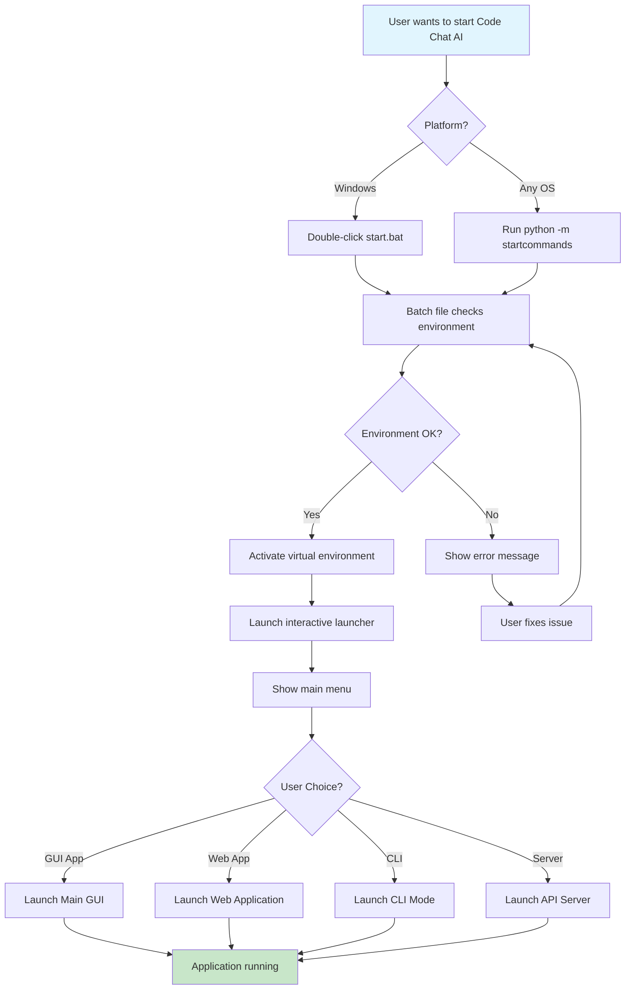

# 🚀 Code Chat AI - Quick Start Guide

## 🎯 Quick Launch Options

## Startup Flow



### Option 1: Double-Click Batch File (Easiest)
Simply **double-click the `start.bat` file** in the project root directory!

**What it does:**
- ✅ Automatically detects and activates your virtual environment
- ✅ Launches the interactive startcommands launcher
- ✅ Provides clear error messages if something goes wrong
- ✅ Works on any Windows system with Python installed

### Option 2: Command Line (Advanced)
```bash
# Interactive launcher (recommended)
python -m startcommands

# Direct command execution
python -m startcommands --run main_gui
python -m startcommands --run web_app
python -m startcommands --list
```

## 📋 What the Batch File Does

The `start.bat` file:
1. **Checks Environment**: Verifies you're in the correct directory
2. **Activates Virtual Environment**: Automatically finds and activates `venv`
3. **Launches Application**: Starts the interactive launcher
4. **Handles Errors**: Provides helpful error messages
5. **Clean Exit**: Waits for user input before closing

## 🎨 What You'll See

When you run `start.bat`, you'll get:

```
===========================================
  🤖 Code Chat AI - Startup Launcher
===========================================

✅ Found virtual environment

🚀 Starting Code Chat AI launcher...

🚀 Code Chat AI - Startup Command Launcher
Choose how you want to start the application
===========================================

🚀 Main Menu
1. 📂 Browse by category
2. 🔍 Search commands
3. 📖 Show help
4. 🚪 Exit launcher
```

## 🖥️ Available Applications

### GUI Applications
- **Main GUI Application**: Full-featured desktop interface
- **Modern GUI Launcher**: Enhanced launcher with better error handling
- **Enhanced UI Launcher**: Improved window visibility

### Web Applications
- **Web Application (Full)**: Complete web app with backend + frontend
- **Web Frontend Only**: NiceGUI web interface
- **Web Backend Only**: FastAPI server

### CLI Applications
- **Standard CLI**: Command-line interface
- **Rich CLI (Enhanced)**: Beautiful CLI with progress bars

### Server Components
- **FastAPI Server**: Standalone API server
- **Server Runner**: Alternative server launcher

## 🚪 How to Exit

- **From Main Menu**: Press `4` or type `quit` or `exit`
- **During Execution**: Use `Ctrl+C` (may need to press multiple times)
- **After Application Launch**: Applications run in background, launcher continues

## 🔧 Troubleshooting

### "startcommands directory not found"
- Make sure you're running the batch file from the project root
- The batch file should be in the same directory as the `startcommands/` folder

### "Virtual environment not found"
- The batch file will still work but may use system Python
- To fix: Create a virtual environment with `python -m venv venv`

### Python/Command Errors
- Ensure Python is installed and in your PATH
- Try running `python --version` in a command prompt

## 📖 More Information

For detailed documentation, see:
- `startcommands/README.md` - Complete launcher documentation
- `README.md` - Main project documentation
- `WEB_APP_README.md` - Web application setup

## 🎉 Happy Coding!

Your Code Chat AI application is now ready to use with the easiest possible launch method! 🚀