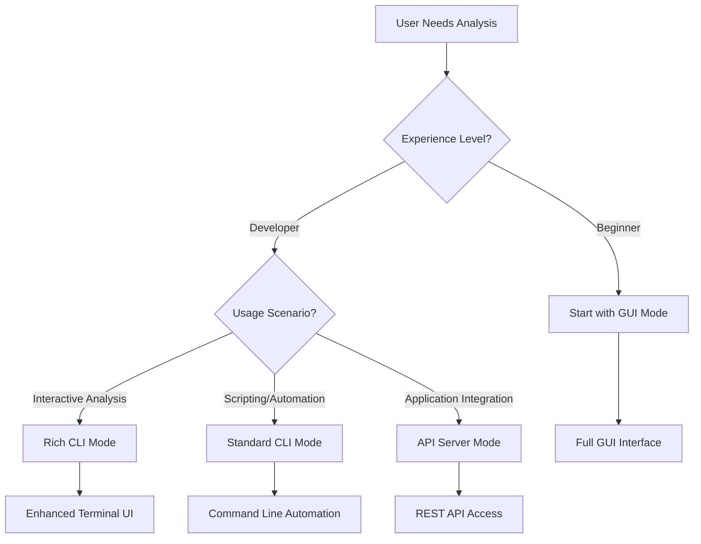
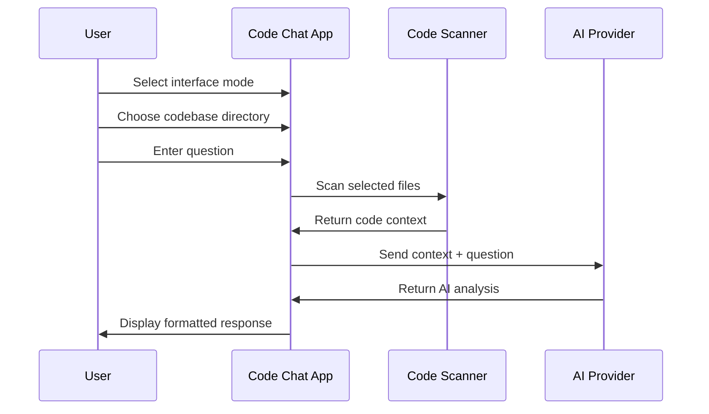

# User Guide - Code Chat with AI

## Overview

Code Chat with AI provides multiple interface modes to suit different user preferences and use cases. This guide covers all available interfaces with step-by-step instructions.

## 🎯 Interface Modes

### 1. GUI Mode (Recommended for Beginners)
### 2. Rich CLI Mode (Enhanced Terminal Experience)
### 3. Standard CLI Mode (Automation & Scripting)
### 4. API Server Mode (Programmatic Access)

---

## 🖥️ GUI Mode - Full Graphical Interface

### Getting Started

1. **Launch the Application**
   ```bash
   python modern_main.py
   ```

2. **First-Time Setup**
   - The application will prompt for API key configuration
   - Click **Settings** → **Environment Variables**
   - Enter your OpenAI or OpenRouter API key
   - Select your preferred AI model

### Main Interface Overview

```
┌─────────────────────────────────────────────────────────────┐
│ 🤖 Code Chat with AI                    Settings │ About     │
├─────────────────────────────────────────────────────────────┤
│ Directory: [C:\Projects\my-app] [Browse...]                 │
├─────────────────────────────────────────────────────────────┤
│ ┌─ Files ──────────────────────┐ ┌─ Question ──────────────┐ │
│ │ 📄 file1.py                 │ │ What does this code do?  │ │
│ │ 📄 file2.py                 │ │ [Send Question]          │ │
│ │ 📄 utils.py                 │ │                         │ │
│ └─────────────────────────────┘ └─────────────────────────┘ │
├─────────────────────────────────────────────────────────────┤
│ ┌─ System Message ─┐ ┌─ Model ─┐ ┌─ Response ──────────────┐ │
│ │ Default          │ │ GPT-4   │ │ AI response appears     │ │
│ └──────────────────┘ └────────┘ │ here...                  │ │
│                                  └─────────────────────────┘ │
├─────────────────────────────────────────────────────────────┤
│ Status: Ready • Openrouter • Input: 150 tokens • Output: 200 │
└─────────────────────────────────────────────────────────────┘
```

### Step-by-Step Usage

#### Step 1: Select Your Codebase
- Click the **Browse...** button
- Navigate to your project directory
- The app will automatically scan for code files
- Supported formats: `.py`, `.js`, `.ts`, `.java`, `.cpp`, `.c`, `.cs`, etc.

#### Step 2: Choose Files for Analysis
- Files appear in the left panel
- Check/uncheck files to include in analysis
- Selected files will be sent to the AI for context
- **Tip**: For large codebases, select only relevant files

#### Step 3: Select AI Expert Mode
- Use the **System Message** dropdown
- Choose from specialized experts:
  - **Default**: General coding assistance
  - **Security**: Vulnerability analysis
  - **Performance**: Optimization suggestions
  - **Code Review**: Quality assessment
  - **Architecture**: System design advice
  - **Debugging**: Bug finding and fixes
  - **Testing**: Test coverage and strategy
  - **Documentation**: Documentation generation

#### Step 4: Choose AI Model
- Select from available models in the **Model** dropdown
- Options include GPT-3.5, GPT-4, Claude models, etc.
- Higher models provide better analysis but cost more

#### Step 5: Ask Your Question
- Type your question in the text area
- Examples:
  - "What does this code do?"
  - "Find potential security vulnerabilities"
  - "How can I optimize this function?"
  - "Review this code for best practices"
- Click **Send Question** or press Enter

#### Step 6: Review AI Response
- AI response appears in the response area
- Code snippets are syntax-highlighted
- Use **📋 Code Fragments** button to extract code blocks
- Responses include token usage and processing time

### Advanced Features

#### Code Fragment Extraction
When AI responses contain code blocks:
1. Click the **📋 Code Fragments** button
2. View all code suggestions in a separate window
3. Select and copy specific code blocks
4. Perfect for implementing AI suggestions

#### Theme Switching
- Click the theme button (🌙 Dark / ☀️ Light)
- Changes apply immediately
- Preference is automatically saved
- **Note**: Restart recommended for full effect

#### Conversation History
- Switch to the **History** tab
- View previous conversations
- Conversations persist across sessions
- Click **Save History** to export as JSON

#### Persistent File Context
- Files from your first question are remembered
- No need to reselect files for follow-up questions
- Context persists until you start a new conversation
- Clear with **New Conversation** button

### Troubleshooting GUI Issues

#### Window Doesn't Appear
```bash
# Try alternative launcher
python start_ui.py
```

#### Files Not Scanning
- Ensure read permissions on directory
- Check for supported file extensions
- Large directories may take time to scan

#### API Connection Issues
- Verify API key in Settings
- Check internet connection
- Test with **Settings** → **Test Connection**

---

## ✨ Rich CLI Mode - Enhanced Terminal Experience

### Launch Options

```bash
# Interactive mode (recommended)
python codechat-rich.py interactive

# Direct analysis
python codechat-rich.py analyze ./src "What does this code do?"

# With specific options
python codechat-rich.py analyze ./src "Find security issues" \
  --model gpt-4 \
  --provider openrouter \
  --include "*.py" \
  --exclude "test_*"
```

### Interactive Mode Walkthrough

1. **Launch Interactive Mode**
   ```bash
   python codechat-rich.py interactive
   ```

2. **Configuration Setup**
   - System detects configuration status
   - Prompts for missing API keys
   - Validates environment settings
   - Shows beautiful status dashboard

3. **Directory Selection**
   - Interactive file browser
   - Directory tree visualization
   - File type filtering
   - Size and count statistics

4. **Question Input**
   - Multi-line question input
   - Question templates available
   - Smart suggestions based on project type
   - Command history

5. **AI Processing**
   - Real-time progress indicators
   - Syntax-highlighted responses
   - Token usage tracking
   - Processing time display

### Rich CLI Features

#### Progress Indicators
- 📊 **Progress Bars**: Visual scanning progress
- ⏱️ **Time Tracking**: Real-time processing times
- 📈 **Statistics**: File counts and sizes
- 🌳 **File Trees**: Beautiful directory visualization

#### Interactive Prompts
- 🎯 **Smart Suggestions**: Context-aware prompts
- 📝 **Question Templates**: Pre-built analysis templates
- 🔄 **Command History**: Navigate previous commands
- 🎭 **Syntax Highlighting**: Color-coded output

#### Configuration Management
```bash
# Validate configuration
python codechat-rich.py config --validate

# Show current settings
python codechat-rich.py config --show

# Interactive configuration
python codechat-rich.py config --interactive
```

#### Model Management
```bash
# List available models
python codechat-rich.py models

# Test specific model
python codechat-rich.py models --test gpt-4

# Models by provider
python codechat-rich.py models --provider openrouter
```

### Advanced Rich CLI Usage

#### Batch Processing
```bash
# Process multiple directories
for dir in src/*/; do
  python codechat-rich.py analyze "$dir" "Analyze this module" \
    --save-to "reports/$(basename "$dir").md"
done
```

#### CI/CD Integration
```bash
# Security analysis in CI
python codechat-rich.py analyze ./src "Find security issues" \
  --output json \
  --save-to security_report.json \
  --model gpt-4
```

---

## 🔧 Standard CLI Mode - Automation & Scripting

### Basic Usage

```bash
# Simple analysis
python minicli.py --cli --folder ./src --question "What does this code do?"

# With specific model
python minicli.py --cli --folder ./src --question "Find bugs" --model gpt-4

# Save output
python minicli.py --cli --folder ./src --question "Analyze code" \
  --output json \
  --save-to analysis.json
```

### Command Line Arguments

#### Required Arguments
- `--cli`: Enable CLI mode
- `--folder PATH`: Path to codebase directory
- `--question TEXT`: Question to ask about the code

#### Optional Arguments
- `--model MODEL`: AI model (default: from .env)
- `--provider {openrouter,tachyon}`: AI provider
- `--include PATTERNS`: File patterns to include
- `--exclude PATTERNS`: File patterns to exclude
- `--output {structured,json}`: Output format
- `--save-to FILE`: Save output to file
- `--verbose, -v`: Show detailed progress

### Output Formats

#### Structured Output (Default)
```
Model: gpt-4
Provider: openrouter
Time: 2.34s
Timestamp: 2023-12-01 14:30:22

Response:
This codebase implements a modern Python application with...
```

#### JSON Output
```json
{
  "response": "This codebase implements...",
  "model": "gpt-4",
  "provider": "openrouter",
  "processing_time": 2.34,
  "timestamp": "2023-12-01 14:30:22"
}
```

### Automation Examples

#### Git Hook Integration
```bash
#!/bin/bash
# .git/hooks/pre-commit

python minicli.py --cli \
  --folder ./src \
  --question "Check for security issues" \
  --system-prompt security \
  --output json \
  --save-to /tmp/security_check.json

# Fail commit if critical issues found
if grep -q "CRITICAL\|HIGH" /tmp/security_check.json; then
  echo "Security issues detected - fix before committing"
  exit 1
fi
```

#### Batch Processing Script
```bash
#!/bin/bash
# analyze_modules.sh

MODULES=("auth" "api" "database" "utils")

for module in "${MODULES[@]}"; do
  echo "Analyzing $module module..."
  python minicli.py --cli \
    --folder "./src/$module" \
    --question "Summarize this module's purpose" \
    --save-to "reports/${module}_summary.md"
done
```

#### CI/CD Pipeline
```yaml
# .github/workflows/code-analysis.yml
name: Code Analysis
on: [push, pull_request]

jobs:
  analyze:
    runs-on: ubuntu-latest
    steps:
      - uses: actions/checkout@v2
      - name: Setup Python
        uses: actions/setup-python@v2
        with:
          python-version: '3.11'
      - name: Install dependencies
        run: pip install -r requirements.txt
      - name: Run code analysis
        env:
          API_KEY: ${{ secrets.OPENROUTER_API_KEY }}
        run: |
          python minicli.py --cli \
            --folder ./src \
            --question "Identify potential issues" \
            --output json \
            --save-to analysis.json
```

### PowerShell Automation Examples

#### Git Hook Integration (PowerShell)
```powershell
# .git/hooks/pre-commit.ps1

& python minicli.py --cli `
  --folder ./src `
  --question "Check for security issues" `
  --system-prompt security `
  --output json `
  --save-to C:\temp\security_check.json

# Read the JSON and check for critical issues
$json = Get-Content C:\temp\security_check.json | ConvertFrom-Json
if ($json.response -match "CRITICAL|HIGH") {
  Write-Host "Security issues detected - fix before committing"
  exit 1
}
```

#### Batch Processing Script (PowerShell)
```powershell
# analyze_modules.ps1

$modules = @("auth", "api", "database", "utils")

foreach ($module in $modules) {
  Write-Host "Analyzing $module module..."
  & python minicli.py --cli `
    --folder "./src/$module" `
    --question "Summarize this module's purpose" `
    --save-to "reports/${module}_summary.md"
}
```

---

## 🌐 API Server Mode - Programmatic Access

### Starting the Server

```bash
# Start FastAPI server
python minicli.py --server

# Or directly
python fastapi_server.py

# With custom port
python minicli.py --server --port 8080

# With custom host
API_HOST=0.0.0.0 API_PORT=8000 python minicli.py --server
```

### API Endpoints

#### GET `/`
Returns server status and available endpoints.

#### POST `/analyze`
Analyze code with AI assistance.

**Request Body:**
```json
{
  "folder": "./src",
  "question": "What does this code do?",
  "model": "gpt-4",
  "provider": "openrouter",
  "include": ["*.py"],
  "exclude": ["test_*"],
  "system_prompt": "default"
}
```

**Response:**
```json
{
  "response": "This codebase implements...",
  "model": "gpt-4",
  "provider": "openrouter",
  "processing_time": 2.34,
  "timestamp": "2023-12-01T14:30:22Z"
}
```

#### GET `/models`
List available AI models.

#### GET `/providers`
List available AI providers.

#### GET `/system-prompts`
List available system message templates.

### API Usage Examples

#### Python Client
```python
import requests

# Analyze code
response = requests.post("http://localhost:8000/analyze", json={
  "folder": "./my-project",
  "question": "Find potential security issues",
  "model": "gpt-4",
  "system_prompt": "security"
})

result = response.json()
print(f"Analysis: {result['response']}")
```

#### cURL Examples
```bash
# Basic analysis
curl -X POST "http://localhost:8000/analyze" \
  -H "Content-Type: application/json" \
  -d '{
    "folder": "./src",
    "question": "What does this code do?"
  }'

# Advanced analysis
curl -X POST "http://localhost:8000/analyze" \
  -H "Content-Type: application/json" \
  -d '{
    "folder": "./src",
    "question": "Review for best practices",
    "model": "gpt-4",
    "include": ["*.py"],
    "exclude": ["test_*"],
    "system_prompt": "code_review"
  }'
```

#### JavaScript/Node.js Client
```javascript
const axios = require('axios');

async function analyzeCode() {
  try {
    const response = await axios.post('http://localhost:8000/analyze', {
      folder: './src',
      question: 'Optimize this function',
      model: 'gpt-4',
      system_prompt: 'performance'
    });
    
    console.log('Analysis:', response.data.response);
  } catch (error) {
    console.error('Error:', error.response.data);
  }
}
```

### API Server Features

- **RESTful Design**: Standard HTTP methods and status codes
- **JSON Communication**: Request/response in JSON format
- **Error Handling**: Comprehensive error responses
- **CORS Support**: Cross-origin resource sharing enabled
- **Documentation**: Auto-generated API docs at `/docs`
- **Health Checks**: Server status monitoring

---

## 🔄 Interface Comparison

| Feature | GUI Mode | Rich CLI | Standard CLI | API Server |
|---------|----------|----------|--------------|------------|
| **User Experience** | Excellent | Very Good | Basic | Programmatic |
| **Visual Feedback** | Full GUI | Terminal UI | Text Only | JSON Response |
| **Setup Complexity** | Low | Medium | Medium | High |
| **Automation** | Limited | Good | Excellent | Excellent |
| **Integration** | Manual | Scripts | CI/CD | Applications |
| **Performance** | Good | Good | Best | Best |
| **Learning Curve** | Low | Medium | Medium | High |

## 📊 Visual Diagrams

### Interface Selection Flowchart


### Analysis Process Sequence


### Choosing the Right Interface

#### For Beginners
- **Start with GUI Mode** - Full graphical interface, easy to learn
- **Progress to Rich CLI** - Enhanced terminal experience with guidance

#### For Developers
- **Use Rich CLI** - Interactive analysis with advanced features
- **Script with Standard CLI** - Automation and CI/CD integration

#### For Integration
- **API Server** - Programmatic access for applications
- **Standard CLI** - Shell scripts and automation pipelines

---

## 🎯 Best Practices

### General Tips

1. **Start Small**: Begin with small, focused questions
2. **Select Relevant Files**: Don't include everything for large codebases
3. **Use Appropriate Models**: GPT-4 for complex analysis, GPT-3.5 for simple queries
4. **Leverage Expert Modes**: Choose the right system prompt for your task
5. **Save Important Conversations**: Use history export for future reference

### Performance Optimization

1. **File Selection**: Be selective with large codebases
2. **Model Choice**: Use appropriate model size for your needs
3. **Caching**: Take advantage of persistent file context
4. **Batch Processing**: Use CLI modes for multiple analyses

### Security Considerations

1. **API Keys**: Never commit API keys to version control
2. **Environment Variables**: Use .env files for configuration
3. **Access Control**: Limit API server access in production
4. **Logging**: Review logs for sensitive information exposure

### Troubleshooting Common Issues

#### Connection Problems
- Check internet connectivity
- Verify API key validity
- Test with simple queries first

#### Performance Issues
- Reduce file selection for large codebases
- Use lazy scanning for big projects
- Consider model size vs. speed trade-offs

#### Configuration Issues
- Validate .env file syntax
- Check file permissions
- Use configuration validation tools

---

## 📚 Additional Resources

- **README.md**: Complete installation and setup guide
- **CLI_USAGE.md**: Detailed CLI command reference
- **TESTING_GUIDE.md**: Testing procedures and validation
- **API_DOCUMENTATION.md**: Technical API reference
- **ARCHITECTURE.md**: System design and patterns
- **CONTRIBUTING.md**: Development and contribution guidelines

This user guide provides comprehensive coverage of all interface modes. Each mode offers unique advantages, so choose the one that best fits your workflow and requirements.