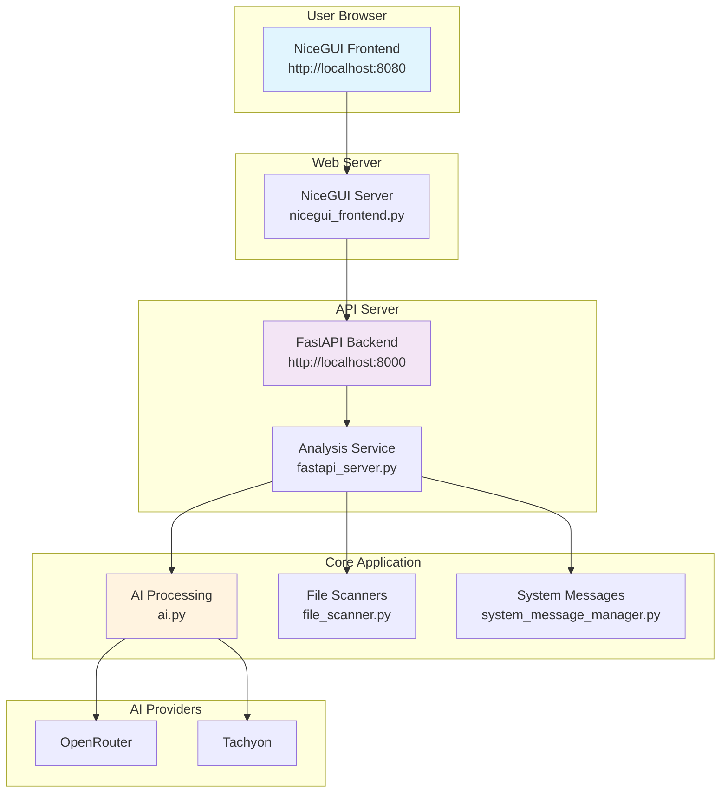
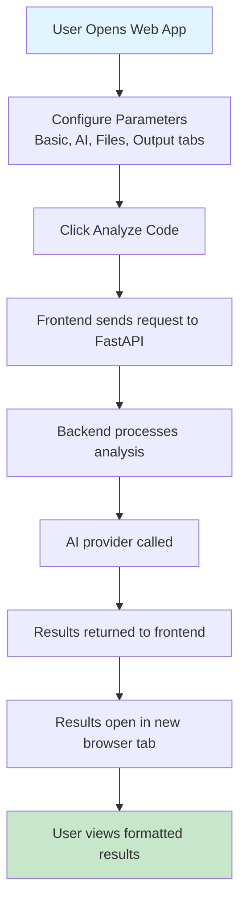

# Code Chat AI - Complete Web Application

A modern, user-friendly web interface for Code Chat AI that provides comprehensive codebase analysis capabilities through an intuitive tabbed interface.

## 🌟 Features

## Web Application Architecture



## User Workflow



### 🎨 Modern Web Interface
- **Tabbed Interface**: Organized parameter groups for easy navigation
- **Clean Design**: Modern, responsive UI with custom styling
- **Real-time Validation**: Form validation with helpful error messages
- **Clear Instructions**: Detailed help text for each parameter

### 🔧 Complete Parameter Support
- **All Analysis Parameters**: Full support for every FastAPI endpoint parameter
- **Dynamic Options**: Models, providers, and system prompts loaded from API
- **File Filtering**: Include/exclude patterns for precise file selection
- **Output Control**: Multiple output formats and file saving options

### 📊 Results Display
- **New Tab Results**: Analysis results open in separate browser tabs
- **Rich Markdown Formatting**: GitHub-style rendering for headings, tables, code blocks
- **Copy to Clipboard**: Easy result sharing and copying
- **Metadata Display**: Processing time, file counts, and configuration details

## 🚀 Quick Start

### Prerequisites
```bash
pip install fastapi uvicorn nicegui httpx
```

### Start the Complete Application
```bash
python run_web_app.py
```

This will start both:
- **FastAPI Backend**: http://localhost:8000
- **NiceGUI Frontend**: http://localhost:8080

### Alternative Startup Methods

#### Start Only Backend
```bash
python run_web_app.py --backend-only
```

#### Start Only Frontend
```bash
python run_web_app.py --frontend-only
```

#### Manual Startup
```bash
# Terminal 1 - Start FastAPI backend
python fastapi_server.py

# Terminal 2 - Start NiceGUI frontend
python nicegui_frontend.py
```

## 📱 User Interface Guide

### Tabbed Parameter Interface

#### 📝 Basic Settings Tab
- **Codebase Folder**: Path to the code directory to analyze
- **Analysis Question**: Your specific question about the codebase

#### 🤖 AI Settings Tab
- **AI Provider**: Choose between OpenRouter, Tachyon, etc.
- **AI Model**: Select the specific model for analysis
- **API Key**: Your API key (optional, uses environment variables)
- **System Prompt**: Customize AI behavior with different prompt types

#### 📁 File Filters Tab
- **Include Patterns**: File patterns to analyze (e.g., `*.py,*.js`)
- **Exclude Patterns**: File patterns to skip (e.g., `test_*,__pycache__`)

#### 📤 Output Tab
- **Output Format**: Choose between structured text or JSON
- **Save to File**: Optional file path for saving results
- **Verbose Logging**: Enable detailed processing information

### Using the Interface

1. **Configure Parameters**: Fill in the required fields (folder and question)
2. **Review Settings**: Check AI model and provider settings
3. **Apply Filters**: Set file include/exclude patterns if needed
4. **Choose Output**: Select format and optional file saving
5. **Analyze**: Click "🔍 Analyze Code" to start processing
6. **View Results**: Results open automatically in a new browser tab

## 🔧 Configuration

### Environment Variables

#### FastAPI Backend
```bash
export API_KEY="your-openai-api-key"
export PROVIDER="openrouter"  # or "tachyon"
export DEFAULT_MODEL="gpt-3.5-turbo"
export MODELS="gpt-3.5-turbo,gpt-4,gpt-4-turbo"
```

#### Web Application
```bash
export FASTAPI_URL="http://localhost:8000"  # Backend URL
export API_PORT="8000"                      # FastAPI port
export WEB_PORT="8080"                      # NiceGUI port
```

### Custom Styling

The interface uses custom CSS for a modern look. You can modify the styling in `nicegui_frontend.py`:

```python
ui.add_css("""
    .your-custom-class {
        /* Your custom styles */
    }
""")
```

## 📊 API Integration

The frontend automatically integrates with the FastAPI backend:

### Endpoints Used
- `GET /models` - Load available AI models
- `GET /providers` - Load available AI providers
- `GET /system-prompts` - Load available system prompts
- `POST /analyze` - Perform code analysis

### Request/Response Format
```json
// Request
{
  "folder": "/path/to/code",
  "question": "Explain the architecture",
  "model": "gpt-3.5-turbo",
  "provider": "openrouter",
  "include": "*.py,*.js",
  "exclude": "test_*",
  "output": "structured"
}

// Response
{
  "response": "Analysis result...",
  "model": "gpt-3.5-turbo",
  "provider": "openrouter",
  "processing_time": 2.34,
  "timestamp": "2025-01-13T12:00:00",
  "files_count": 15
}
```

## 🎨 Interface Screenshots

### Main Interface
```
┌─────────────────────────────────────────────────┐
│ 🤖 Code Chat AI              📚 API Docs        │
├─────────────────────────────────────────────────┤
│                                                 │
│ 📝 Basic    🤖 AI     📁 Files    📤 Output     │
│                                                 │
│ ┌─────────────────────────────────────────────┐ │
│ │ 📁 Codebase Folder                        │ │
│ │ [____________________] [📂 Browse]         │ │
│ │ Select the folder containing your code...  │ │
│ └─────────────────────────────────────────────┘ │
│                                                 │
│ ┌─────────────────────────────────────────────┐ │
│ │ ❓ Analysis Question                        │ │
│ │ [________________________________________] │ │
│ │ Ask a specific question about your code... │ │
│ └─────────────────────────────────────────────┘ │
│                                                 │
│ [🔍 Analyze Code] [🔄 Reset Form]              │
└─────────────────────────────────────────────────┘
```

### Results Display
```
┌─────────────────────────────────────────────────┐
│ 🤖 Code Chat AI - Analysis Results              │
├─────────────────────────────────────────────────┤
│ 📊 Analysis Summary                             │
│ 📁 Files: 15  🧠 Model: gpt-3.5-turbo          │
│ ⏱️ Time: 2.34s  📅 2025-01-13T12:00:00       │
│                                                 │
│ 💬 AI Response                                  │
│ This is the analysis result from the AI...     │
│ [📋 Copy Response]                             │
└─────────────────────────────────────────────────┘
```

## 🧪 Testing

### Run Integration Tests
```bash
# Test the FastAPI backend
python run_fastapi_tests.py

# Test with real server
python run_fastapi_tests.py --real-server
```

### Manual Testing
1. Start the web application
2. Open http://localhost:8080
3. Fill in the form parameters
4. Click "Analyze Code"
5. Verify results open in new tab

## 🐛 Troubleshooting

### Common Issues

#### Frontend Won't Load
```bash
# Check if backend is running
curl http://localhost:8000/health

# Check dependencies
python run_web_app.py --check-deps
```

#### Analysis Fails
- Verify API key is configured
- Check file permissions on the target folder
- Ensure the folder contains analyzable files

#### Results Don't Open
- Check browser popup blocker settings
- Verify JavaScript is enabled
- Try opening the results URL manually

### Debug Mode
```bash
# Enable verbose logging
export PYTHONPATH=.
python -c "import logging; logging.basicConfig(level=logging.DEBUG)"
python run_web_app.py
```

## 📈 Performance Tips

### For Large Codebases
- Use **lazy loading** in file filters
- Set appropriate **include/exclude patterns**
- Choose **faster models** for initial analysis
- Enable **verbose logging** to monitor progress

### For Better Results
- Be **specific** in your questions
- Use **file filters** to focus on relevant code
- Choose **appropriate AI models** for your needs
- Experiment with different **system prompts**

## 🔒 Security Considerations

- API keys are handled securely (masked in logs)
- File paths are validated before processing
- No sensitive data is stored in the web interface
- All communication uses HTTP (consider HTTPS for production)

## 🚀 Production Deployment

### Using Docker
```dockerfile
FROM python:3.9-slim

WORKDIR /app
COPY requirements.txt .
RUN pip install -r requirements.txt

COPY . .
EXPOSE 8000 8080

CMD ["python", "run_web_app.py"]
```

### Using Systemd
```ini
[Unit]
Description=Code Chat AI Web App
After=network.target

[Service]
Type=simple
User=www-data
WorkingDirectory=/path/to/app
ExecStart=/path/to/venv/bin/python run_web_app.py
Restart=always

[Install]
WantedBy=multi-user.target
```

## 📞 Support

### Getting Help
1. Check the troubleshooting section above
2. Review the API documentation at `/docs`
3. Check the test suite for examples
4. Verify your environment configuration

### Common Questions

**Q: Why does the analysis take so long?**
A: Large codebases or complex questions take more time. Use file filters to reduce scope.

**Q: Can I use this without an API key?**
A: No, you need a valid API key for the chosen AI provider.

**Q: How do I change the default ports?**
A: Set the `API_PORT` and `WEB_PORT` environment variables.

**Q: Can I customize the styling?**
A: Yes, modify the CSS in `nicegui_frontend.py`.

---

**🎉 Happy Analyzing!** Explore your codebases with the power of AI through this intuitive web interface!